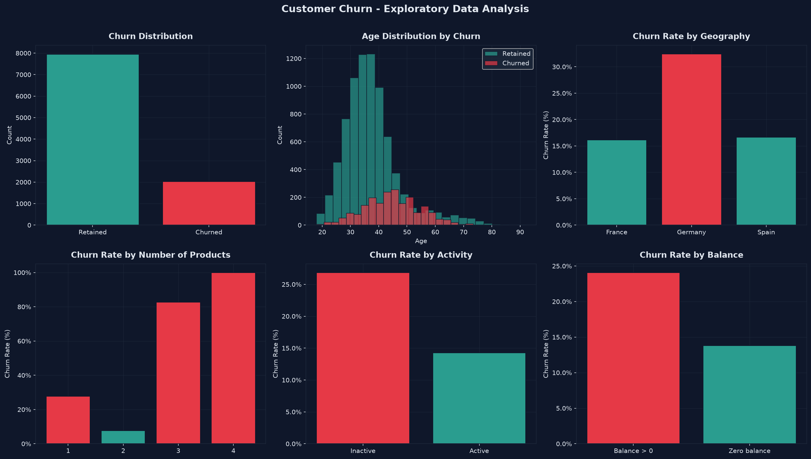
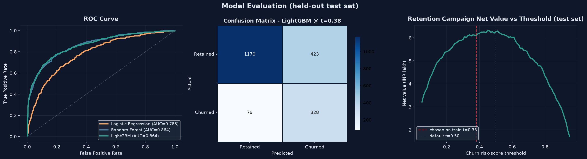

# 📊 Customer Churn Prediction — Banking Use Case

> **Real data · LightGBM vs Random Forest vs Logistic Regression · Test AUC 0.864 · Profit-based retention targeting**

An end-to-end churn project on **10,000 real, anonymised customers of a European retail bank**. It covers the full chain: EDA, feature engineering, model comparison, a profit-based decision threshold, an interactive Streamlit dashboard and an auto-generated executive briefing.

---

## 🎯 Results

| Metric | Value |
|---|---|
| **Dataset** | 10,000 customers, 20.4% churn ([Bank Customer Churn](https://www.kaggle.com/datasets/shrutimechlearn/churn-modelling)) |
| **Best model** | LightGBM, selected on 5-fold cross-validated AUC |
| **Test AUC** | **0.864** (CV 0.863 ± 0.011) vs 0.785 for a Logistic Regression baseline |
| **PR-AUC** | 0.716 (a random model scores 0.20) |
| **Top-10% capture** | The riskiest 10% of customers contain **41%** of all churners (**4.1x lift**) |
| **Top-20% capture** | 63% of churners |
| **Campaign value** | ₹6.08 lakh per 2,000 customers with model targeting vs ₹2.21 lakh contacting everyone* |

\*Under stated assumptions: ₹500 per contact, ₹10,000 per retained churner, 30% of reached churners retained. These are placeholders you can change at the top of `churn_model.py`.

All numbers come from a 2,000-customer test set that is never used for training, model selection or choosing the threshold.

### Does the risk score hold up?
| Predicted segment | Customers | Actual churn |
|---|---|---|
| High Risk (score > 0.60) | 462 | 60.0% |
| Medium Risk (0.30–0.60) | 459 | 16.1% |
| Low Risk (score < 0.30) | 1,079 | 5.2% |

---

## 🔍 What drives churn

| Finding | Churn rate |
|---|---|
| 3–4 products held | 86% (vs 8% for 2 products) — likely unwanted cross-sells |
| Inactive members aged 50+ | 82% |
| Age 50+ | 45% vs 16% under 50 |
| Germany | 32% vs 16% in France / Spain |
| Inactive members | 27% vs 14% active |




---

## 🧠 Design decisions

- **Model selection on CV, not the test set.** LightGBM and Random Forest tie on test AUC (0.864). LightGBM is chosen because it wins on cross-validated AUC and PR-AUC, so the test set stays a clean final check.
- **Threshold chosen by money, on training data only.** The pipeline sweeps thresholds on out-of-fold predictions for the training set and picks the one with the highest campaign net value (0.38), then reports it on the test set. An earlier version picked the threshold on the test set itself, which made it look better than it was. On the test set the value curve is nearly flat between 0.3 and 0.6, so the gain comes from targeting at all (₹6.08 lakh vs ₹2.21 lakh), not from the exact cut-off.
- **Ranking metrics for a ranking problem.** A retention team works down a list, so top-decile capture and lift matter more than accuracy.
- **Class imbalance** (20% churners) is handled with class weights rather than synthetic oversampling.
- **Gain-based feature importance** for LightGBM. Split-count importance overrates continuous features such as salary.

### Engineered features
| Feature | Definition |
|---|---|
| `zero_balance` | Balance is exactly 0 (36% of customers) |
| `balance_to_salary` | Balance / estimated salary |
| `products_per_tenure` | Products held / (tenure + 1) |
| `inactive_multi_prod` | Inactive member holding 2+ products |
| `senior` | Age ≥ 50 |

---

## 🗂️ Project structure

```
customer-churn-prediction/
├── churn_model.py           # EDA → features → 3 models → business evaluation → artefacts
├── report_generator.py      # Executive briefing; every number computed from pipeline outputs
├── dashboard.py             # Streamlit dashboard (reads metrics.json, nothing hard-coded)
├── run_all.bat              # Runs the whole pipeline, then opens the dashboard
├── data/
│   ├── Churn_Modelling.csv      # Source data (10,000 customers)
│   └── scored_customers.csv     # Test set with churn risk scores and campaign flag
├── models/                  # Trained pipelines (.pkl)
└── reports/
    ├── metrics.json             # All scores and campaign economics
    ├── executive_report.md      # Executive briefing
    ├── eda_plots.png, model_evaluation.png, feature_importance.png
    └── classification_reports.txt, eda_summary.txt
```

## 🚀 How to run

```bash
pip install -r requirements.txt
python churn_model.py        # trains models, writes reports/ and models/
PYTHONIOENCODING=utf-8 python report_generator.py   # writes reports/executive_report.md (the env var avoids a ₹ encoding error on Windows consoles)
streamlit run dashboard.py   # opens http://localhost:8501
```
On Windows, `run_all.bat` does all three.

## ⚠️ Limitations

- The data is a single snapshot, so the model predicts *who* churns, not *when*. A production model would use monthly behaviour history.
- Campaign economics use assumed costs and save rates; a real rollout should measure the save rate with an A/B test.
- Scores rank customers but are not calibrated probabilities: class weighting lifts the average test score to 0.35 against 20% actual churn. Treat them as risk scores.
- Age and gender are predictive but sensitive; a deployed model would need a fairness review.

---

**Nitesh** · B.Tech ECE (AI & ML) · NSUT Delhi
